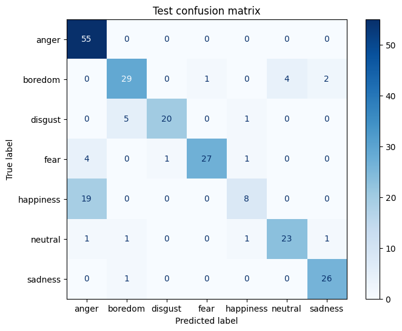
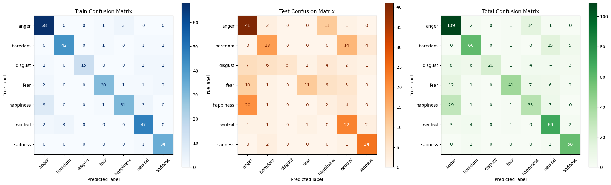
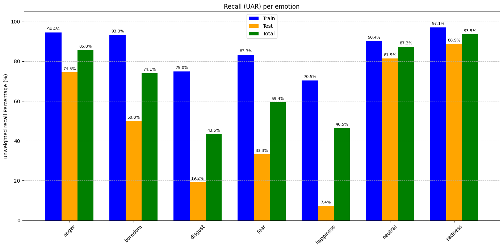

# RO11_Emotion_CNN

*Team: Pierre Bordeau, Nathan Chandanson, Rémi Moshfeghi*

To test the recording, spectrogram generation and CNN prediction, you can go on our "WebApp" that is a Google Colab notebook, [here](https://colab.research.google.com/drive/1cyjidaOfuTCavoaeDVHlS3_26hQDtFAd?usp=sharing).

## Introduction

This repo contains the code of our team for the CNN Emotion project of course 5RO11 at ENSTA.

This README explains the methods we use to prepare the data (spectrogram generation, etc.), to prepare the CNN models we made, and it presents the results we obtained.

- [RO11\_Emotion\_CNN](#ro11_emotion_cnn)
  - [Introduction](#introduction)
  - [Database used](#database-used)
  - [Spectrogram generation - Nathan Chandanson](#spectrogram-generation---nathan-chandanson)
    - [Results](#results)
  - [CNN from scratch - Rémi Moshfeghi](#cnn-from-scratch---rémi-moshfeghi)
    - [Method](#method)
    - [Results](#results-1)
  - [Transfer learning with ResNet18 - Pierre Bordeau](#transfer-learning-with-resnet18---pierre-bordeau)
    - [Method](#method-1)
      - [Data preparation](#data-preparation)
      - [Model modification](#model-modification)
      - [Training](#training)
    - [Results](#results-2)
        - [Confusion matrix](#confusion-matrix)
        - [Unweighted Average Recall (UAR) per class](#unweighted-average-recall-uar-per-class)
        - [Conclusion](#conclusion)

## Database used

The Database used is EmoDB, which contains recordings in german, from 10 speakers, with 7 emotions (anger, boredom, disgust, fear, happiness, sadness, neutral).

We can use the entire dataset (816 recordings), that contains recordings where the emotion is not very clear (low confidence by the annotators), or the "gold standard" dataset (535 recordings), that contains only recordings where the emotion is very clear.

The dataset is already split into a train and test dataset, with 6 speakers in the train dataset and 4 speakers in the test dataset. We kept this split for our experiments. 

This split means that the train and test datasets have different speakers, which is a good way to evaluate the generalization of our models.

## Spectrogram generation - Nathan Chandanson

### Results

## CNN from scratch - Rémi Moshfeghi
The goal of this part is to build a CNN from scratch that takes a spectrogram as an input and outputs a prediction of the speaker's emotion.

### Method
The training process is presented in the `fromScratch_trainer.ipynb` file. First, a CNN architecture is defined. From a single channel 301x64px image (the spectrogram), we go to 32, then 64, then 128, then 256 channels, dividing the size of the image by four at each layer using a MaxPool operation. Each layer consists of a sequence that we repeat two times : a 3x3 convolution, a batch normalization and a ReLU activation. Each of the 256 channels is then averaged, and a final fully connected layer produces prediction for each of the seven emotions.

### Results
The model was trained over 50 epochs, but the weights were saved based on the epoch that gave the best accuracy on the test set. These weights yield a 100.0% accuracy on the train set, and a 81.4% accuracy on the test set which points at overfitting. We include the confusion matrix on the test set :

## Transfer learning with ResNet18 - Pierre Bordeau

The idea is to take the ResNet18 model pretrained on ImageNet and to fine-tune it on our dataset of spectrograms. 

Instead of training the entire model, we will only train the last fully connected layer of the model. The rest of the model will be frozen.

### Method

**The training process is presented in the `resnet18_training.ipynb` file**

#### Data preparation

The ResNet18 model expects images of size 224x224x3 as input. Therefore, we needed to same all the spectrograms of both train and test datasets as 224x224x3 images. We used matplotlib to save the images, using a grayscale colormap so that the images are 3 channels but with the same values in each channel, and making sure the images are the right size and do not have any axes or labels.

#### Model modification

The model is retrieved from the `torchvision.models` library, and is pretrained on ImageNet.

The first step is to modify the last fully connected layer of the model to have 7 outputs instead of 1000 (the number of classes in ImageNet).

This layer represents 3,591 parameters that will be trained, which is a very small number compared to 11,180,103 parameters of the entire model

#### Training

We used settings that are standard for transfer learning on image CNNs, with a batch size of 32, a learning rate of 0.001 and the Adam optimizer.

We made multiple trainings of the model, and eventually a training with 20 epoches seemed to give good results.

At the end of training, we save the model weights in a file called `resnet18_emotion.pth`, which can be used to make predictions on new data. This file is loaded in the Google Colab notebook "WebApp" to make predictions on new recordings.

### Results

Here are the results we obtained at the end of the training:

`Epoch 20/20 | Train loss: 0.7090 | Train accuracy: 84.54% | Test loss: 1.1378 | Test accuracy: 53.25%`

- Train Dataset Evaluation
  - Loss: 0.6138
  - Accuracy: 87.83%
  - UAR (Macro Recall): 86.30%
- Test Dataset Evaluation
  - Loss: 1.1378
  - Accuracy: 53.25%
  - UAR (Macro Recall): 50.70%

##### Confusion matrix

##### Unweighted Average Recall (UAR) per class

##### Conclusion

The results are not perfect, but they match the results obtained by the U2IS team for the FineTuned ResNet18 model
